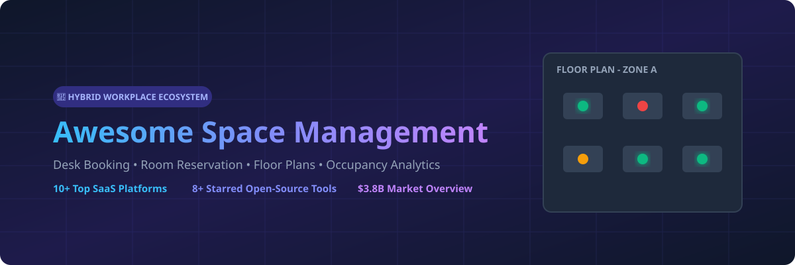

# 🏢 Awesome Space Management | Top Desk Booking & Room Reservation Ecosystem 🚀

  

  
  
  
  

> **Curated List of Commercial SaaS Products & Self-Hosted Open-Source Projects for Space Management, Desk Booking, Room Reservations, Floor Plan Mapping & Hybrid Office Experience.** 

**📅 Last updated: September 2026**

---

## 📌 Overview & Category Insights

This repository tracks top-tier **Space Management Software**, **Desk Booking Systems**, **Meeting Room Reservation Tools**, and **IWMS (Integrated Workplace Management Systems)**. These solutions enable hybrid organizations, facilities teams, and workplace operations managers to optimize office space utilization, manage hot-desking, visualize interactive floor plans, and enhance employee productivity.

---

## 📑 Table of Contents

- [🏢 Commercial SaaS Platforms](#-commercial-saas-platforms)
- [💻 Open-Source GitHub Projects](#-open-source-github-projects)
- [🤝 How to Contribute](#-how-to-contribute)
- [⚠️ Disclaimer](#️-disclaimer)
- [📈 Star History](#-star-history)

---

## 🏢 Commercial SaaS Platforms

> 📊 **Market Insights**: The global Space Management & IWMS software market is valued at **~$3.8 Billion** (projected to reach **$7.5 Billion** by 2030 at a 12.5% CAGR). The sector is **moderately fragmented**, balancing consolidated enterprise giants (Eptura, Johnson Controls/FM:Systems) with fast-growing specialized hybrid workplace platforms (Envoy, Robin, Skedda).

*Sorted by Company Size / Market Scale (descending).*

| Platform 🔗 | Description 📝 | Company Size (Valuation / ARR) 💰 | Starting Price 🏷️ | Free Tier / Trial Limit 🎁 |
| :--- | :--- | :--- | :--- | :--- |
| **[Condeco / Eptura Engage](https://eptura.com/)** | Enterprise meeting-room and desk booking solution with deep Microsoft 365 integration and workplace analytics. | ~$2.8 Billion valuation (~$266M ARR portfolio) | $5/user/month (~$1,500/year base tier) | No free forever plan; 0-day self-serve trial (enterprise demo upon request) |
| **[SpaceIQ / Eptura](https://eptura.com/)** | Broader workplace and IWMS capabilities including space planning, asset management, and booking. | ~$2.8 Billion valuation (~$266M ARR portfolio) | $50/user/month (~$5,000/year base plan) | No free forever plan; 0-day self-serve trial (custom enterprise demo upon request) |
| **[Envoy Workplace / Desks](https://envoy.com/)** | Desk and room booking combined with visitor management, occupancy insights, and workplace security features. | $1.4 Billion valuation (~$96M ARR) | $3/user/month ($109/month per location) | Free Basic tier for Visitor Management (up to 100 visitors/mo); 14-day free trial for Workplace & Desks |
| **[FM:Systems / Archibus](https://www.fmsystems.com/)** | Established IWMS and facilities management platforms including space management, planning, and workplace modules. | $455 Million acquisition value (~$38.5M ARR) | $300/user/month (~$10,000/year enterprise base) | No free forever plan; 0-day self-serve trial (guided executive demo upon request) |
| **[Robin](https://robinpowered.com/)** | Modern workplace platform emphasizing interactive maps, desk and room booking, AI scheduling, and occupancy analytics. | ~$37.8 Million ARR ($60M total funding) | $3/user/month ($1,500/year Starter tier) | No free forever plan; 14-day free trial with full feature access |
| **[OfficeSpace Software](https://www.officespacesoftware.com/)** | End-to-end space management platform focused on space planning, move management, booking, and facilities workflows. | ~$30.9 Million ARR ($150M funding from Vista Equity) | $500/month (base plan starting tier) | No free forever plan; 0-day self-serve trial (guided demo available upon request) |
| **[Kadence](https://kadence.co/)** | Hybrid workplace management platform focusing on desk/room booking, team event scheduling, and analytics. | ~$15.0 Million ARR ($36.8M total funding) | $4/user/month (billed annually) | No free forever plan; 14-day free trial with full feature access |
| **[Skedda](https://www.skedda.com/)** | Popular mid-market space booking platform known for interactive floor plans, flexible booking rules, and per-space pricing. | ~$11.5 Million ARR (Five Elms Capital backed) | $99/month (Starter plan, includes up to 15 spaces) | No free forever plan; 30-day free trial with full feature access (no credit card required) |
| **[Officely](https://officely.ai/)** | Slack and Microsoft Teams integrated desk booking and hybrid workplace scheduling tool. | ~$5.0 Million ARR ($2M seed funding) | $2.50/user/month (billed annually) | Free forever plan for up to 5 employees; 14-day free trial on paid plans |
| **[Eden Workplace](https://www.edenworkplace.com/)** | Workplace experience and operations platform covering desk booking, visitor management, and office services. | ~$4.3 Million ARR ($28M total funding) | $89/month per location (Accelerate plan) | Free Starter tier for up to 5 employees; 14-day free trial on paid plans |

---

## 💻 Open-Source GitHub Projects

*Self-hosted open-source desk reservation, room booking, and space management systems. Sorted by GitHub Star Count (descending).*

| Project 🔗 | GitHub Stars ⭐ | Description 📝 | Key Tech Stack ⚙️ |
| :--- | :---: | :--- | :--- |
| **[indico/indico](https://github.com/indico/indico)** |  | CERN's open-source event management and room reservation platform for campus-scale space and conference room scheduling. | Python, Flask, React |
| **[LibreBooking/LibreBooking](https://github.com/LibreBooking/LibreBooking)** |  | Open-source resource and room reservation system (evolved from Booked Scheduler) supporting interactive calendars, quotas, and permissions. | PHP, MySQL |
| **[seatsurfing/seatsurfing](https://github.com/seatsurfing/seatsurfing)** |  | Open-source desk sharing, room booking, and free-seating management system featuring floor plan maps, mobile PWA, and Docker deployment. | Go, Vue.js, Docker |
| **[classroombookings/classroombookings](https://github.com/classroombookings/classroombookings)** |  | Open-source room and resource booking application for managing room reservations, timetables, and recurring room blocks. | PHP, CodeIgniter |
| **[sebo-b/warp](https://github.com/sebo-b/warp)** |  | Workspace Autonomous Reservation Program for hybrid office space management (assigned desks, hot desks, occupancy visibility). | Python, Flask, HTML5 |
| **[kanwalnainsingh/OpenDesk](https://github.com/kanwalnainsingh/OpenDesk)** |  | Open-source hybrid office desk booking system aimed at optimizing office desk utilization and employee space reservations. | Node.js, Express, React |
| **[igeligel/workplacify](https://github.com/igeligel/workplacify)** |  | Open-source desk reservation and scheduling platform designed for hybrid workplaces as an easy self-hosted commercial alternative. | TypeScript, React, Node.js |
| **[ConductionNL/deskdesk](https://github.com/ConductionNL/deskdesk)** |  | Open-source desk booking and open-office seat reservation system with calendar sync and Nextcloud integration. | PHP, Nextcloud API |

---

## 🤝 How to Contribute

We welcome community contributions! Follow these steps to add or update entries:

1. 🍴 **Fork** this repository.
2. ✏️ **Edit** `README.md` following the table structure above.
3. 📝 Include: Project name, official website/repo URL, concise description, specific pricing/star count, and free tier details.
4. 🔀 **Open a Pull Request** with a brief summary of changes.

---

## ⚠️ Disclaimer

- This list is **community-curated** for informational purposes and does not constitute an endorsement.
- Space management software processes employee location and attendance schedules. Organizations should evaluate compliance, GDPR, data protection, and security policies when selecting tools.

---

## 📈 Star History

---

**Made with ❤️ for workplace experience leaders, facilities managers, hybrid office builders, and platform engineers.**

